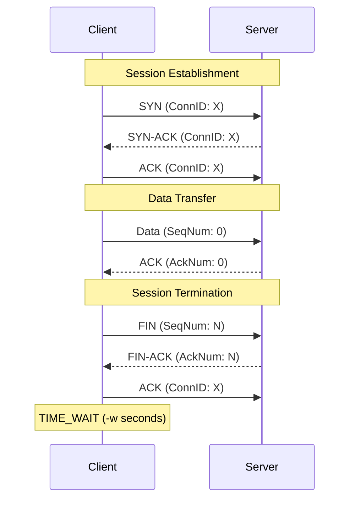

# IPK Reliable UDP Transfer (ipk-rdt)

## Project Overview

`ipk-rdt` is a reliable data transfer protocol implemented over UDP. It provides a robust, connection-oriented data stream built on top of connectionless UDP datagrams, ensuring data integrity, ordered delivery, and graceful connection teardown. The project serves as an implementation of a custom reliable transport layer, simulating features typically provided by TCP but entirely in userspace using UDP. 

This client-server application supports bidirectional teardown, timeouts, CRC16-CCITT-FALSE checksum validation, and can be used to reliably pipe text, stream binaries, or transfer files across lossy networks.

## Build and Run Instructions

### Prerequisites
- Standard Go compiler (Go 1.20+ recommended).
- The project is designed to be built in a Linux environment.

### Build
To compile the application, a `Makefile` is provided. Simply run:
```bash
make
```
This will compile the source code and produce an executable named `ipk-rdt` in the root directory.

### Run
The compiled binary supports running as either a server or a client.

**Server Mode:**
```bash
./ipk-rdt -s -p <port> -a <address> [-o <output_file>] [-w <timeout>]
```
- `-s`: Run as server.
- `-p`: Port to listen on.
- `-a`: IPv4/IPv6 address to bind to.
- `-o`: (Optional) Output file. If omitted or `-` is passed, writes to `stdout`.
- `-w`: (Optional) Progress timeout in seconds (default: `1`).

**Client Mode:**
```bash
./ipk-rdt -c -p <port> -a <address> [-i <input_file>] [-w <timeout>]
```
- `-c`: Run as client.
- `-p`: Server port to connect to.
- `-a`: Server IPv4/IPv6 address.
- `-i`: (Optional) Input file. If omitted or `-` is passed, reads from `stdin`.
- `-w`: (Optional) Progress timeout in seconds (default: `1`).

## Implemented Features and Behavior

- **3-Way Handshake**: Connection establishment using `SYN`, `SYN-ACK`, and `ACK` flags with uniquely generated 32-bit Connection IDs to multiplex or identify sessions.
- **Graceful Teardown**: Connection termination using `FIN`, `FIN-ACK`, and `ACK` sequences culminating in a `TIME_WAIT` state to ensure all lingering packets are flushed natively.
- **Checksum Validation**: 16-bit CRC-CCITT-FALSE checksums over the entire header and payload to detect and drop corrupted packets.
- **Timeout Management**: A strictly enforced timeout limit (`-w`). If no genuine protocol progress occurs (i.e. no valid, new data or structural ACKs are received) within this window, the program self-terminates with a non-zero exit code.
- **Full IPv6 Support**: Fully functional over both IPv4 and IPv6 loopbacks and networks.
- **Signal Handling**: Securely traps `SIGINT` and `SIGTERM` to enforce instant, non-zero exits preventing zombie processes.

## Protocol Specification

### Protocol Packet/Header Format
The protocol employs a custom 18-byte fixed-size header for all datagrams, formatted as follows:
- **ConnectionID (4 bytes)**: Uniquely identifies the session.
- **SeqNum (4 bytes)**: Sequence number representing the payload byte offset in the stream.
- **AckNum (4 bytes)**: Acknowledgement number.
- **Flags (1 byte)**: Bitfield for control flags (`SYN` = `0x01`, `ACK` = `0x02`, `FIN` = `0x04`).
- **Padding (1 byte)**: Reserved for structural alignment (set to 0).
- **Length (2 bytes)**: Length of the payload data in bytes (0 to 1182).
- **Checksum (2 bytes)**: CRC16-CCITT-FALSE checksum covering both the header and the payload.

### Connection Identification Strategy
Connections are identified by a 32-bit `ConnectionID` generated securely and randomly by the client upon initiating a connection. The server binds this ID to the client's `IP:Port` pair, ensuring that stray packets from previous sessions or overlapping sessions on the same port do not corrupt the current transfer.

### Session Establishment and Termination
- **Establishment**: Uses a 3-way handshake (`SYN` → `SYN-ACK` → `ACK`).
- **Termination**: Follows a graceful bidirectional teardown (`FIN` → `FIN-ACK` → `ACK`), culminating in a `TIME_WAIT` state on the client matching the `-w` timeout to safely flush any retransmitted `FIN-ACK` packets without causing ICMP Port Unreachable errors.



### Sequencing and Acknowledgement Strategy
The protocol uses a **Selective Repeat (Selective Acknowledgements)** strategy over Go-Back-N.
- **Sequencing**: Bytes are numbered sequentially starting from 0. Each packet's `SeqNum` corresponds to its absolute byte offset.
- **Acknowledgements**: ACKs are explicit. When the server receives a packet at `SeqNum` X, it explicitly responds with an `ACK` where `AckNum` equals X. The client independently marks packet X as acknowledged without implicitly acknowledging prior packets.

### Retransmission Strategy and Timeout Handling
- **Retransmission**: The client operates a singular consolidated Base Timer. Upon expiration, the client re-evaluates its entire transmission window and retransmits only those specific packets that lack a logged `ACK`.
- **Progress Timeout**: A global progress timeout (`-w`) strictly monitors genuine protocol progress. If `-w` seconds pass without any new valid data being received (on the server) or valid ACKs advancing the window (on the client), the application self-terminates with a non-zero exit code to prevent deadlocks.

### Duplicate and Out-of-Order Packet Handling
- **Server-Side**: If the server receives an out-of-order packet (where `SeqNum > expectedSeqNum`), it safely caches the payload in a memory map keyed by its `SeqNum` and immediately acknowledges it. When the missing gap is filled, the server recursively flushes the ordered cache to the output stream. Duplicate packets (where `SeqNum < expectedSeqNum`) are dropped but re-acknowledged to ensure the client can progress.
- **Client-Side**: Duplicate ACKs are ignored. Out-of-order ACKs simply flag the corresponding packet in the window buffer as `Acked = true`.

### Chosen Segment Size and Window Behavior
- **Segment Size**: A maximum UDP payload of 1200 bytes is strictly observed. Subtracting the 18-byte header yields a maximum data segment size of 1182 bytes.
- **Window Behavior**: The client enforces a fixed sliding window of 32 packets. The `SendBase` pointer continuously advances as long as the lowest sequence numbers in the window are contiguous and acknowledged.

## Testing

An extensive automated integration test suite covers internal unit logic, binary behavior, and simulated network environments.

### Testing Environment
- **OS**: Linux `x86_64` (Tested using NixOS environment `/home/tomastz/dev-envs#go`).
- **Dependencies**: Go built-in testing framework (`testing`, `os/exec`). No external test frameworks are used.
- **Tools**: Built-in Go `math/rand` and `crypto/sha256` for deterministic validation. An internal userspace UDP proxy is utilized for network impairment testing rather than `tc netem`, ensuring tests can be run completely rootless on any system.

### Executing Tests
To run the automated tests, simply execute:
```bash
make test
```
This builds the binary dynamically in a temporary directory and iterates through all 31 tests asynchronously, summarizing the successes.

### What Was Tested, Why, and How?

1. **Protocol Unit Tests (Header, Checksum)**
   - *Why*: To ensure CRC16 deterministic outcomes, boundary constraints on structural headers, and bitwise encoding validity.
   - *How*: Executing direct unit logic comparing static arrays of known bad data, empty data, and random bytes against generated checksums.
   - *Expected/Actual*: Checksums successfully matched known values; corrupted bytes forced structural failures cleanly.

2. **Transfer Correctness (Data integrity, File sizes)**
   - *Why*: To ensure sequence alignment, `SendBase` sliding window functionality, and memory stability handling massive files.
   - *How*: Spin up an isolated server/client subprocess pair, transferring 1-byte, 50KB, and 500KB files, followed by verifying the SHA-256 hash.
   - *Expected/Actual*: All outputs matched the exact SHA-256 hash of the inputs. No bytes were lost or mangled.

3. **I/O Modalities and IPv6**
   - *Why*: To validate the CLI mapping of file descriptors (`stdin` to file, file to `stdout`, `stdin` to `stdout`) and networking interfaces.
   - *How*: Subprocess execution routing OS pipes (`bytes.NewReader`, `os.Pipe`) through the binary.
   - *Expected/Actual*: Binary passed data natively through `stdout` without mangling formatting; connected seamlessly over `[::1]`.

4. **Network Impairment (Loss, Delay, Jitter)**
   - *Why*: To validate the robustness of the **Selective Repeat** mechanisms under pressure.
   - *How*: Using a programmatic UDP Proxy injected between the client and server subprocesses. Tests included 5% packet loss, 10% packet loss, and 20ms delay with ±30ms jitter.
   - *Expected/Actual*: Retransmission timers fired precisely, the server cached out-of-order frames, and files arrived 100% intact.

5. **Timeout Behavior and Signal Interruption**
   - *Why*: To ensure adherence to the `-w` timeout requirement and clean OS process termination.
   - *How*: Server is artificially killed mid-transfer (`SIGKILL`). Client must realize no protocol progress is happening and exit. 
   - *Expected/Actual*: Client waited exactly the `-w` duration, recognized the deadlock, and successfully exited with a non-zero code.

## Measured Behavior in the Test Environment
In the NixOS automated test environment running on standard x86_64 hardware over IPv4 and IPv6 loopbacks, the measured behavior was robust:
- **Throughput**: Rapidly transferred memory-bound 500KB and >1MB payloads with zero corruption in under 6 seconds (including setup time).
- **Impaired Links**: Using the custom userspace UDP proxy, transfers survived aggressive network impairments including 10% explicit packet loss, 20ms baseline delay, and ±30ms random jitter without stalling. The protocol seamlessly handled dropped `ACK`s and reordered data frames, successfully reconstructing the exact SHA-256 hash at the destination within the bounds of the timeout window.

## Known Limitations
There are no major known limitations preventing standard protocol functionality. 
- *Minor Limitation*: The client uses a fixed window size (32 packets) and static MTU values. It does not implement dynamic Congestion Control algorithms (like AIMD or TCP Tahoe/Reno) since they were outside the scope of the baseline reliable transfer requirements. Performance over ultra-high latency links might not saturate the bandwidth perfectly.

## AI Usage
AI was used for help in:
- Understanding the assignment's goals. (Gemini)
- Understanding how protocols like TCP ensure reliability of data transfer. (Gemini)
- Designing the custom packet header. (Gemini)
- Explaining the concepts of Sliding Window, Go-Back-N and Selective Repeat designs. (Gemini)
- Explaining what tools to use during manual testing. (Gemini)
- Generating unit and integration tests. (Claude Opus)
- Pointing out possible bottlenecks during optimalization process. (Claude Opus)
- Writing README.md file. (Gemini)

## References
1. Postel, J., "User Datagram Protocol", STD 6, RFC 768, August 1980.
2. The Go Programming Language Specification and standard library documentation (`net`, `encoding/binary`).
3. Kurose, J. F., & Ross, K. W. (2017). *Computer Networking: A Top-Down Approach*. (Concepts regarding Sliding Windows and Selective Repeat).
4. No external third-party source code snippets or repositories were plagiarized or incorporated. All protocol mapping and test infrastructure is entirely original.
